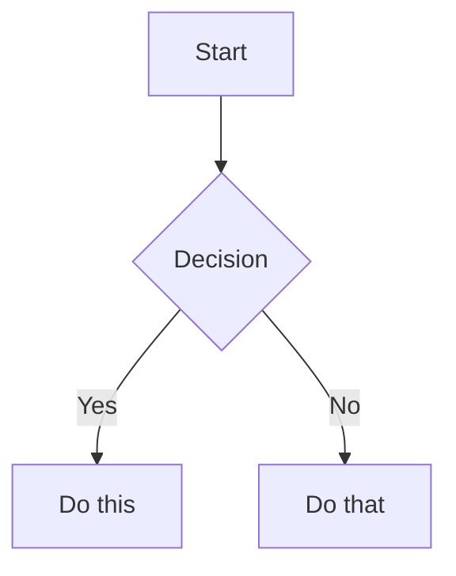

# TextualMD

A powerful terminal-based Markdown viewer built with [Textual](https://textual.textualize.io/), providing a rich interface for viewing, navigating, and exporting Markdown files directly in your terminal.

Note: this was all generated using Cursor as a test case for new project creation.

## Features

### Core Viewing Capabilities
- **Dual View Modes**: Toggle between rendered Markdown and raw text views
- **Syntax Highlighting**: Beautiful rendering of Markdown elements including headers, lists, code blocks, and more
- **Mermaid Diagram Support**: Automatically renders Mermaid diagrams in Markdown files
- **Dark/Light Themes**: Switch between dark and light modes for comfortable viewing

### Navigation & Organization
- **File Explorer**: Built-in file tree for browsing and opening Markdown files
- **Table of Contents**: Auto-generated outline panel for quick navigation through document sections
- **Search Functionality**: Full-text search with highlighting and navigation between results
- **Auto-reload**: Watches files for changes and automatically refreshes the view

### Export & Sharing
- **Multi-format Export**: Export your Markdown to HTML, PDF, or DOCX formats
- **Browser Preview**: Open rendered Markdown directly in your default web browser
- **Standalone HTML**: Exported HTML files include all styling for perfect rendering

## Installation

### Quick Install (Recommended)

TextualMD can be installed globally using [uv](https://github.com/astral-sh/uv), a fast Python package manager:

```bash
# Install uv first (if you haven't already)
curl -LsSf https://astral.sh/uv/install.sh | sh

# Install TextualMD globally
uv tool install git+https://github.com/phunt/textualMD

# Or install from local directory
git clone <repository-url>
cd textualMD
uv tool install .
```

This installs two commands: `textualmd` and `tmd` (shorter alias).

### Alternative: Development Installation

For development or if you prefer using pip:

```bash
# Clone the repository
git clone <repository-url>
cd textualMD

# Create a virtual environment (using uv)
uv venv
source .venv/bin/activate  # On Windows: .venv\Scripts\activate

# Install in development mode
uv pip install -e .

# Or use traditional pip
pip install -e .
```

### Requirements
- Python 3.13 or higher
- No system dependencies required!

## Usage

### Basic Usage

Once installed globally with uv:

```bash
# Run without arguments to see the welcome screen
tmd

# Open a specific Markdown file
tmd README.md

# Open any Markdown file
tmd ~/Documents/notes.md

# Use the full command name
textualmd path/to/your/file.md
```

### Keyboard Shortcuts

| Key | Action | Description |
|-----|--------|-------------|
| `r` | Toggle Raw/Rendered | Switch between rendered Markdown and raw text view |
| `d` | Toggle Dark Mode | Switch between dark and light themes |
| `f` | Toggle File Tree | Show/hide the file explorer panel |
| `t` | Toggle Table of Contents | Show/hide the document outline panel |
| `s` | Search | Open search interface |
| `e` | Export | Export to HTML, PDF, or DOCX |
| `o` | Open in Browser | View the document in your web browser |
| `q` | Quit | Exit the application |

### Search Navigation
When in search mode:
- `Enter` - Jump to next search result
- `Shift+Enter` - Jump to previous search result
- `Escape` - Close search

## Examples

### Viewing a README file
```bash
tmd README.md
```
This opens the README in rendered mode. Press `r` to see the raw Markdown source.

### Exploring a Documentation Folder
```bash
tmd docs/
```
Press `f` to open the file tree and browse through multiple Markdown files.

### Exporting to Different Formats
1. Open your Markdown file
2. Press `e` to export
3. Find the exported files in the `exports/` directory

### Using Table of Contents
1. Open a Markdown file with multiple headers
2. Press `t` to show the table of contents
3. Click on any header to jump to that section

## Features in Detail

### File Watching
The application automatically monitors the currently open file for changes. When the file is modified externally (e.g., in another editor), the view refreshes automatically. Look for the 👁 icon in the header to confirm file watching is active.

### Mermaid Diagram Support
The viewer automatically detects and renders Mermaid diagram blocks:



### Export Options
The export feature (`e` key) creates three formats simultaneously:
- **HTML**: Standalone HTML with embedded styles
- **PDF**: Print-ready PDF document
- **DOCX**: Microsoft Word compatible document

All exports are saved in the `exports/` directory with timestamps.

## Development

### Project Structure

```
textualMD/
├── pyproject.toml       # Project configuration and dependencies
├── src/
│   └── textualmd/       # Main package
│       ├── __init__.py
│       ├── main.py          # Entry point
│       ├── app.py           # Main application logic
│       ├── app_types.py     # Type definitions
│       ├── constants.py     # Application constants
│       ├── services/        # Core services
│       │   ├── file_manager.py
│       │   ├── file_watcher.py
│       │   ├── markdown_processor.py
│       │   ├── search_engine.py
│       │   └── export_manager.py
│       └── ui/              # User interface
│           ├── widgets.py
│           ├── styles.py
│           └── bindings.py
└── requirements.txt     # Legacy dependency file
```

### Running from Source

During development, you can run the application directly from the source:

```bash
# Using uv (recommended)
uv run tmd README.md

# Or if you have activated the virtual environment
python -m textualmd README.md
```

### Adding Dependencies

To add new dependencies:

```bash
# Add a new dependency
uv add package-name

# Add a development dependency
uv add --dev pytest

# Update the global installation
uv tool install . --force
```

### Testing Changes

For development, you might want to install in editable mode:

```bash
uv tool install . --force --editable
```

This way, changes to the source code are immediately reflected without reinstalling.

## Known Issues

- **Bullet List Rendering**: In Textual v5.0.1, bullet points may appear on separate lines from their text in the rendered view. This is a limitation of the current Markdown widget.

## Contributing

Feel free to open issues or submit pull requests. Check the `TODO.md` file for planned features and known issues.

## License

[Add your license information here]