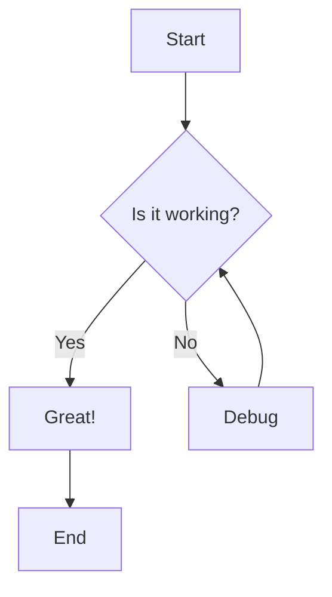
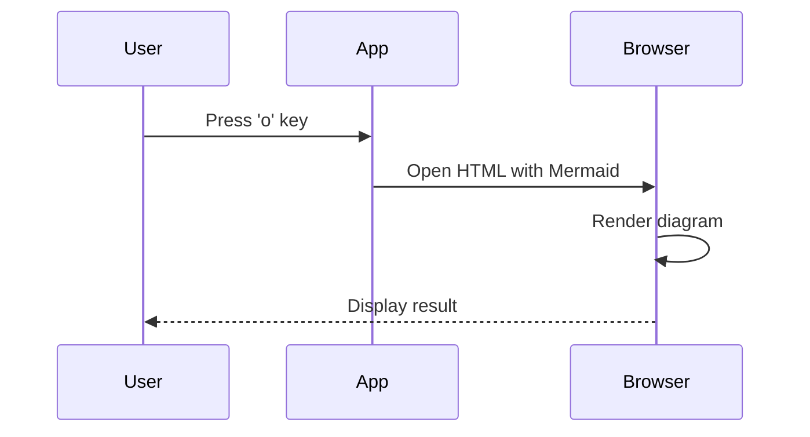

# Test Mermaid Diagram

This is a test document to demonstrate Mermaid diagram support.

## Flow Chart Example

Here's a simple flowchart:



## Sequence Diagram Example

And here's a sequence diagram:



## Regular Code Block

This is just a regular code block, not a Mermaid diagram:

```python
def hello():
    print("Hello, World!")
```

## More Content

The Mermaid diagrams above will be:
- Shown as placeholders in the terminal view
- Fully rendered when you open in browser (press 'o') 